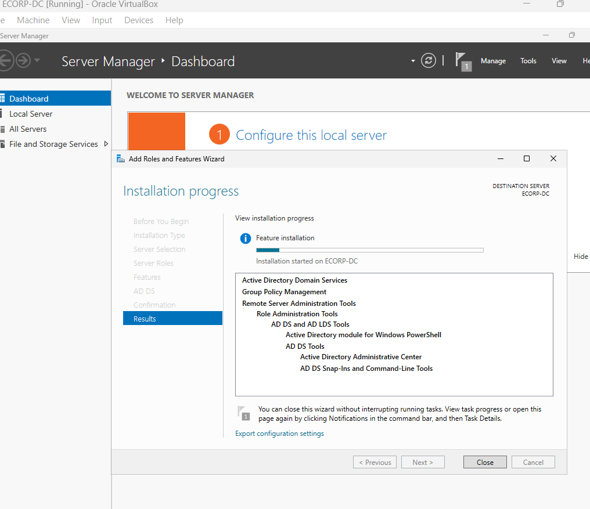
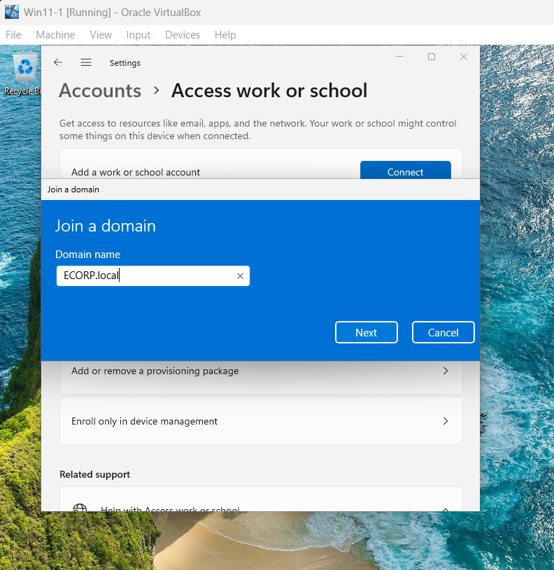
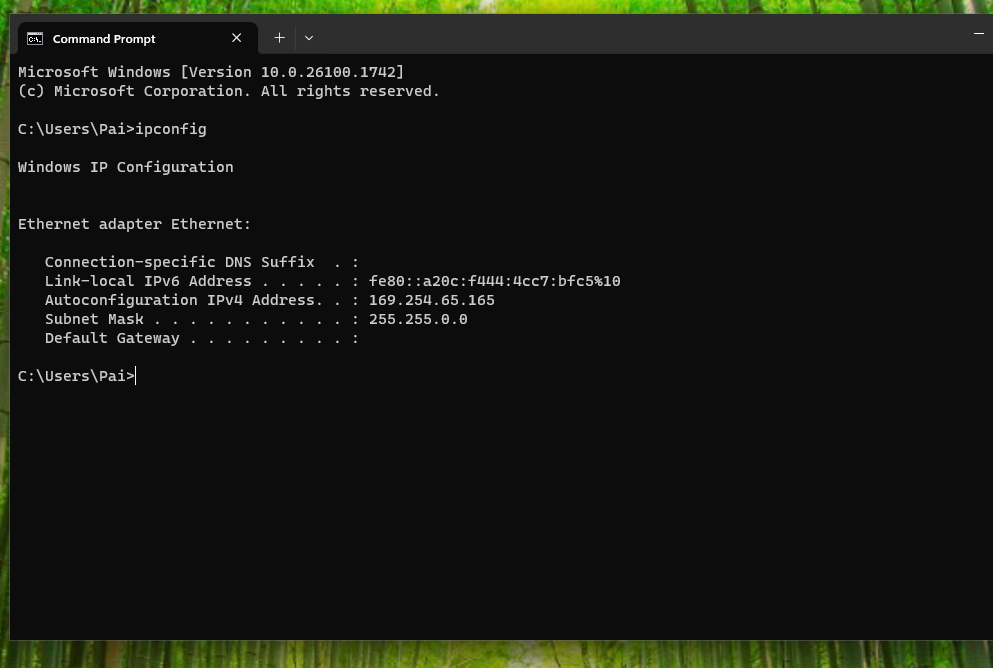
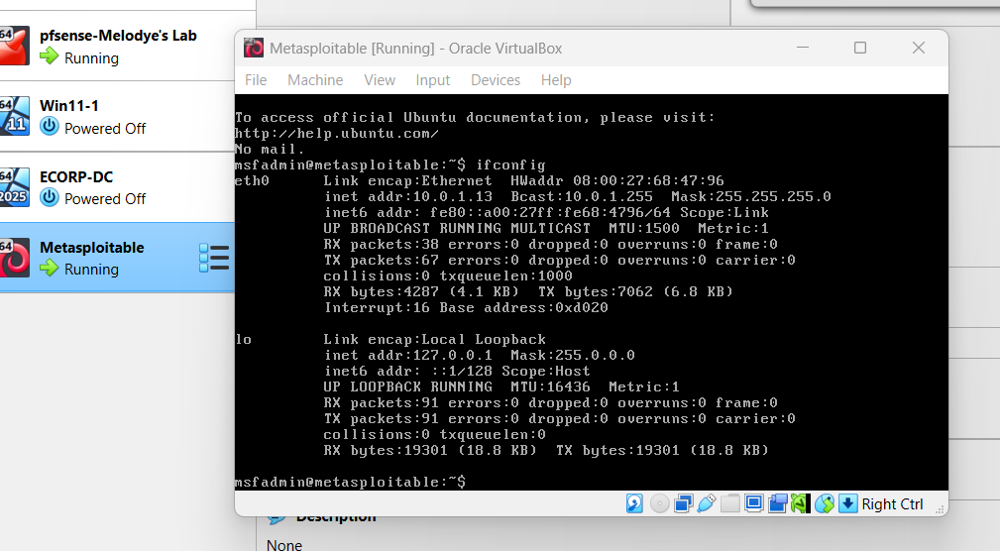
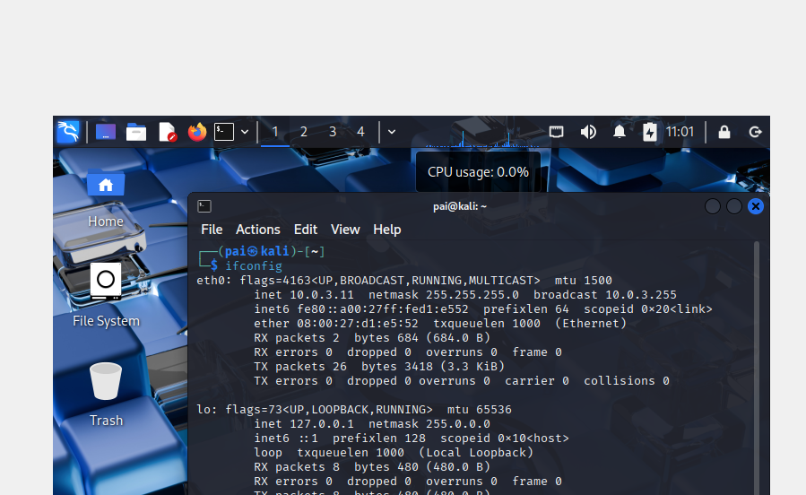
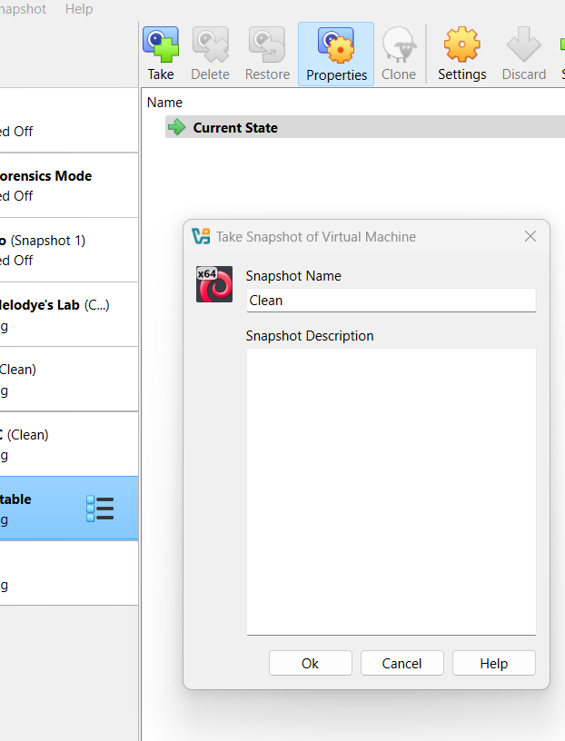

# Enterprise Security Lab – Part 1: Lab Setup for Mr. Robot Exercise

## 1. Overview
This project documents the buildout of a realistic enterprise lab environment that will serve as the foundation for the upcoming **Mr. Robot Red/Blue Team Exercise (Part 2)**.  

The environment simulates a corporate network with a firewall, segmentation, Active Directory domain infrastructure, endpoints, logging, and vulnerable systems. This project demonstrates skills in enterprise environment configuration, network security, and endpoint administration.

---

## 2. Lab Architecture

### Components
- **pfSense Firewall** – Router, DHCP, network segmentation
- **ECORP LAN**
  - Windows Server (Domain Controller + DNS + Certificate Authority)
  - Windows 11 Client (domain-joined)
  - Metasploitable 2 (vulnerable Linux host)
- **Attack LAN**
  - Kali Linux (attack platform)

> **Segmentation:** ECORP LAN is fully segmented from the Attack LAN and internet access is tightly controlled through pfSense firewall rules.

---

## 3. Environment Buildout

### 3.1 pfSense Configuration

The lab began by installing **pfSense** on a dedicated VM that would serve as the lab's router and firewall. During the initial configuration:  
- Created three interfaces: **WAN**, **ECORP LAN**, and **Attack LAN**.  
- Enabled **DHCP services** for the LAN networks to provide IP addresses to connected hosts.  
- Validated network connectivity by logging into the pfSense web interface from the Windows 11 host.
- Began configuring the firewall, including changing default credentials.
- Set a static IP address for the Windows 11 client.

**Interface & DHCP Setup**

*pfSense interface configuration showing WAN, ECORP LAN, and Attack LAN networks with DHCP enabled.*

**Alias Creation**

An alias was created for the **RFC1918** private IP address ranges to simplify firewall rule management.

*Alias grouping RFC1918 private IP address ranges to simplify firewall rule creation.*

---

### 3.2 Firewall Rules (Segmentation)

Once the interfaces were in place, firewall rules were configured to enforce a **deny-by-default** policy:  
- Allow ECORP LAN internal traffic.  
- Allow ECORP LAN to access the internet (by inverting the RFC1918 alias).  
- Block all other traffic from ECORP LAN.  
- Restrict the Attack LAN so it can communicate with ECORP LAN (for testing), but **cannot** reach the internet or WAN.

*Example firewall rule set applied to ECORP LAN and Attack LAN.*

> See the [full firewall rule set here](images/) for all supporting screenshots.

---

### 3.3 Active Directory & Domain Setup

With the network baseline in place, the next step was to deploy **Windows Server** and establish a domain environment.  

- Installed **Windows Server** on the ECORP LAN and assigned a static IP address.  
- Configured the server as a **Domain Controller (ECORP.local)**.  
- Installed **Active Directory Certificate Services (AD CS)** as an Enterprise Root CA.  
- Created administrative, standard, and service user accounts, and configured a shared network folder with group-based permissions.

*Initial Active Directory configuration of ECORP.local domain.*

A **Windows 11 client** was then installed and joined to the new domain:

*Windows 11 client joined to the ECORP.local domain.*

---

### 3.4 Windows 11 Client & Endpoint Configuration

Once the client was domain-joined:  
- **Sysmon** was installed for detailed endpoint logging.  
- **Splunk Enterprise** was deployed for centralized log collection.  
- A Group Policy Object (GPO) was applied to disable Windows Defender on endpoints to simulate a less secure baseline environment.

*Windows 11 endpoint after domain join and static IP configuration.*

---

### 3.5 Metasploitable Target

To simulate a vulnerable internal system:  
- Installed **Metasploitable 2** on the ECORP LAN.  
- Verified connectivity from both the Attack LAN and ECORP LAN systems.

*Metasploitable vulnerable host on the ECORP LAN.*

---

### 3.6 Kali Linux (Attack LAN)

On the Attack LAN, a **Kali Linux** VM was deployed to serve as the attack platform for future simulations. Connectivity was validated with pfSense and ECORP LAN systems.

*Kali Linux attack VM configured on the Attack LAN.*

---

### 3.7 Snapshots

Finally, baseline **snapshots** were created for all VMs (pfSense, Windows Server, Windows 11, Kali, Metasploitable) to preserve a clean environment before starting the Mr. Robot exercise.

---

## 4. Skills Demonstrated

- **Firewall Administration:** pfSense installation, interface configuration, DHCP, aliasing, and deny-by-default firewall rules  
- **Network Security & Segmentation:** Creating isolated LANs and controlling cross-network communication  
- **Active Directory Administration:** Domain Controller setup, user/group provisioning, GPOs, Certificate Authority configuration  
- **Endpoint Configuration:** Domain joining, Sysmon installation, centralized logging setup (Splunk)  
- **Vulnerability Targeting Setup:** Building an enterprise-like environment with attackable hosts (Metasploitable)  
- **Virtualization Management:** Multi-VM networking and snapshots  

---

## 5. Next Steps

This environment will be used in **Part 2: Mr. Robot Red/Blue Team Exercise**, where I will:  
- Simulate attacks from the Attack LAN (Kali) targeting ECORP LAN hosts  
- Detect and respond using Sysmon, Splunk, and firewall logs  

**Full image set:** [See all screenshots in the images folder](images/)

